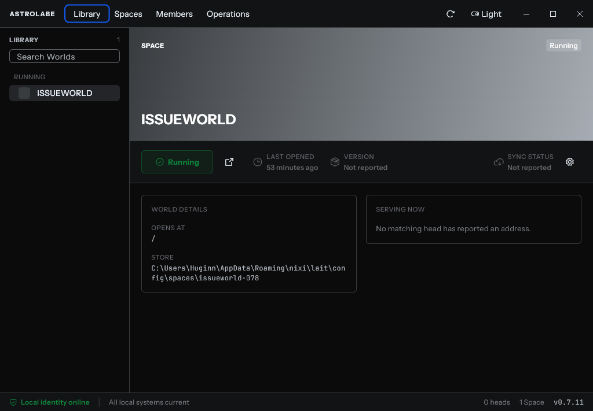
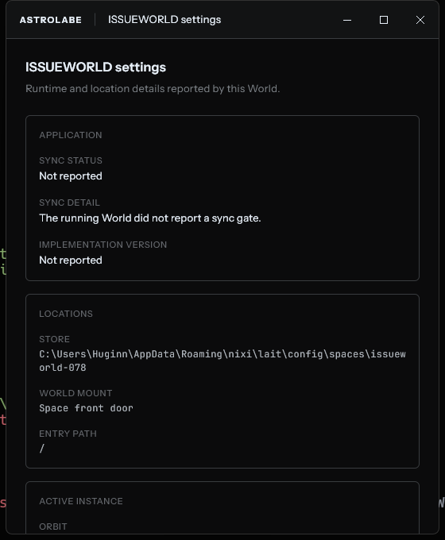

# Covalence limits uncovered in Astrolabe

Date: 2026-08-13

## Executive finding

Covalence is not preventing the border, padding, colour, radius, density, or hover refinement Astrolabe needs. Those axes already exist and are themeable. The boundary we reached is one level higher: Covalence is a strong domain-blind token, primitive, and interaction substrate, but it is not yet a desktop-product grammar. Astrolabe still has to define its own application shell, master/detail Library composition, lifecycle/status band, multi-window contract, and process-backed state semantics.

## Evidence captured

### Step 1 — Library, running World

General health: **Good visual foundation; compound layout remains app-owned.**

The screen shows that Covalence can support the intended dark vocabulary, restrained borders, compact typography, status colour, icon-only actions, and consistent control sizing. The full-bleed hero, left rail, fixed action/status band, operational footer, lifecycle status, and responsive grouping are nevertheless all composed in Astrolabe. Covalence supplies the ingredients but no canonical pattern for this screen shape.

### Step 2 — World settings secondary window

General health: **Visually coherent; desktop window behavior and settings structure remain app-owned.**

The secondary window now carries the same dark surface and type vocabulary as the main client. Covalence provides the content tokens and card-like surfaces, but not the window creation policy, native title-bar suppression, caption metrics, close semantics, theme propagation between processes, or a desktop settings-window composition.

## Limits, separated from ordinary underuse

### 1. Tokens do not choose product composition

Covalence can express edge strokes, spacing rungs, radii, surface depth, semantic colour, typography, motion, and density. It cannot decide that Astrolabe's hero should be full bleed, that the open band should sit directly below it, which edges receive dividers, or how the Library rail and content align. The early padding and border problems were therefore not missing capability; they were missing Astrolabe layout policy.

This boundary is deliberate. ADR-007 says components carry presentation and behaviour, never domain category. A `Running World`, daemon state, orbit, or sync gate belongs to Astrolabe. Covalence should only absorb a treatment when a domain-free visual/behavioural pattern remains after those nouns are removed.

### 2. There is no reusable desktop shell pattern

Astrolabe had to introduce its own shared window frame, caption, primary navigation band, rail, and operational footer. Covalence has page scaffolds and list-page patterns, but no desktop application frame that composes custom chrome, navigation, status footer, and a body region.

This should probably remain an Astrolabe pattern until another Covalence consumer needs the same shape. The generic parts worth extracting later would be a desktop split view, a fixed status/action band, or a headless caption-control behavior—not an `AstrolabeShell` component in the design system.

### 3. Compound lifecycle and metadata bands are missing

The stable `Launch / Launching / Running + go-to`, `Last opened`, `Version`, `Sync status`, and settings row is a coherent compound surface, but Covalence has no pattern that owns its alignment, wrapping policy, state priority, or compact metadata readouts. Astrolabe implemented `_WorldAction`, `_LifecycleState`, and `_StatusReadout` itself.

The consequence was visible during refinement: changing the go-to action to an icon-only button exposed the enclosing `Wrap` policy and moved the control group unexpectedly. The primitive button behaved correctly; the absent compound layout contract was the problem.

A domain-free `StatusReadout` and responsive `ActionStatusBand` are plausible Covalence candidates if the same shapes appear in at least two features.

### 4. Stateful, responsive, and animated recipes are explicitly incomplete

Covalence has breakpoint tokens, but its recipe ADR explicitly defers breakpoint-conditional attributes, state-driven attributes, and animated style transitions. Callers still write `LayoutBuilder`, `Row`/`Wrap` switching, hover state, alpha blending, and animation policy by hand.

Astrolabe's lifecycle slab is the concrete example: it derives a subtle fill and border by applying separate alpha values to a semantic tone. That works, but it is a local recipe rather than a shared, contrast-tested status treatment. Similar local derivations can drift across light/dark modes and features.

### 5. Operating-system chrome is a hard platform boundary

Covalence can theme the visible caption, but it cannot create or govern native windows. Astrolabe must use `window_manager` for hidden title bars, dragging, maximize state, close policy, process launch, minimum geometry, and OS-sized targets. The 46-pixel caption target and other OS metrics correctly require token escapes because they are not design-rhythm decisions.

Custom Flutter chrome also costs native behavior: the current implementation documents the loss of the `Alt+Space` system menu and the Windows 11 snap-layout flyout because the window plugin cannot provide the required non-client hit-test response. This is not something a colour or spacing system can solve.

### 6. Theme construction is not theme preference or multi-window synchronization

Covalence can build light and dark themes, but it does not persist a user's choice or synchronize it across separately launched processes. The settings window currently receives a dark/light snapshot on launch. Live cross-window theme changes, preference storage, and OS-theme following remain Astrolabe responsibilities.

### 7. The closure is strong in theory but not complete in practice

Covalence's lint layer is valuable because it makes raw colour, geometry, type, duration, and shadow escapes review-visible. However, the recipe migration is still partial and legacy composers coexist with the newer recipe/materialization model. Covalence's README also records 34 internal raw-primitive warnings.

Running `dart run custom_lint` against Astrolabe found seven current warnings: five token escapes without the required adjacent reason comment and two raw Flutter sizing primitives. This does not mean Astrolabe lacks a way to express those values; it means enforcement and migration are not yet clean enough to guarantee consistency automatically.

### 8. Accessibility support stops where custom composition bypasses primitives

Covalence provides headless keyboard/focus/semantics primitives, focus rings, semantic labels, and contrast tests. Those protections are strongest when a product composes through the provided controls. Custom-painted caption buttons, bespoke status surfaces, and app-owned responsive bands can bypass parts of that behavior and must be audited separately.

For example, the caption controls expose pointer hover/press state, tooltips, and semantics, but they are implemented through `MouseRegion` and `GestureDetector`, not a Covalence headless button. Screenshot review cannot establish keyboard reachability, focus order, screen-reader output, text scaling behavior, or full contrast compliance.

### 9. Runtime truth is outside the design system

The stale `Last opened`, daemon attachment, active origins, sync gates, and multiple concurrently running Worlds are data/lifecycle problems. Covalence can present those states but cannot make them true, reconcile them, or decide their transition model. Treating those failures as visual component limitations would hide the real contract that needs fixing in Astrolabe's client/core boundary.

## Practical boundary

**Keep in Astrolabe:** domain state mapping, daemon/process lifecycle, window creation and close policy, Library information architecture, top/bottom bars, World settings, and app theme preference.

**Potentially promote to Covalence after reuse is proven:** a domain-free compact status treatment, labelled metadata readout, responsive action/status band, desktop split-view layout, and a headless custom-caption interaction primitive.

**Already available and should be used more rigorously:** semantic surface/border/text/status tokens, contextual layers, Card/SectionCard variants, Button variants including ghost icon-only controls, spacing/radius/stroke ladders, focus primitives, density, motion, and light/dark theme construction.

## Evidence limits

This audit covers the captured running Library and secondary settings states plus the local Covalence and Astrolabe source/ADRs. The issue-tracker transport was unavailable during this pass. Loading, empty, error, unavailable, narrow-window, light-theme, keyboard-only, screen-reader, high-contrast, and text-scaling states were not captured here, so this is not a complete accessibility or responsive certification.
