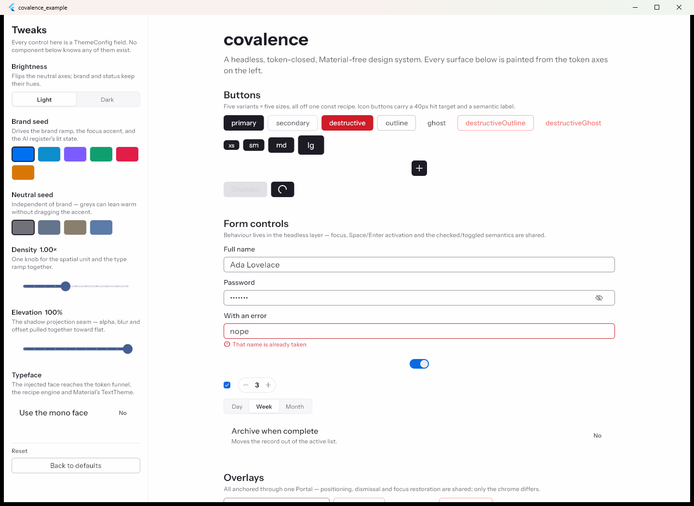
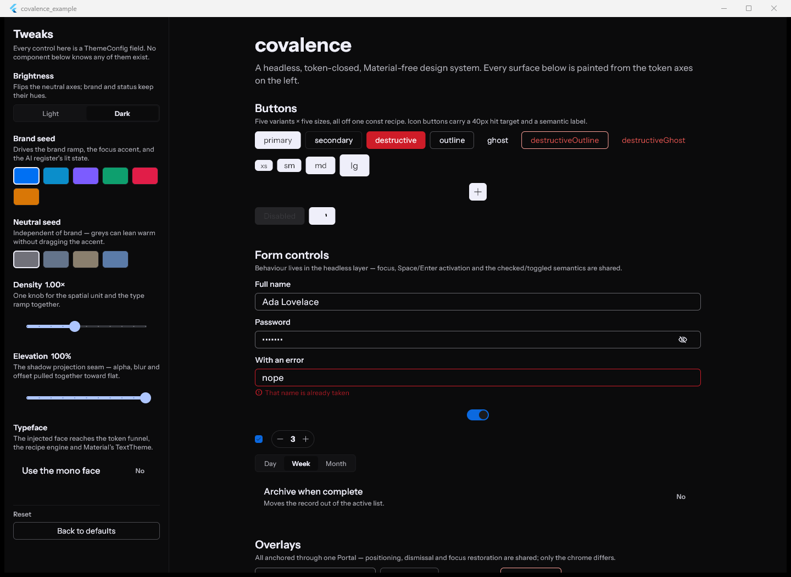
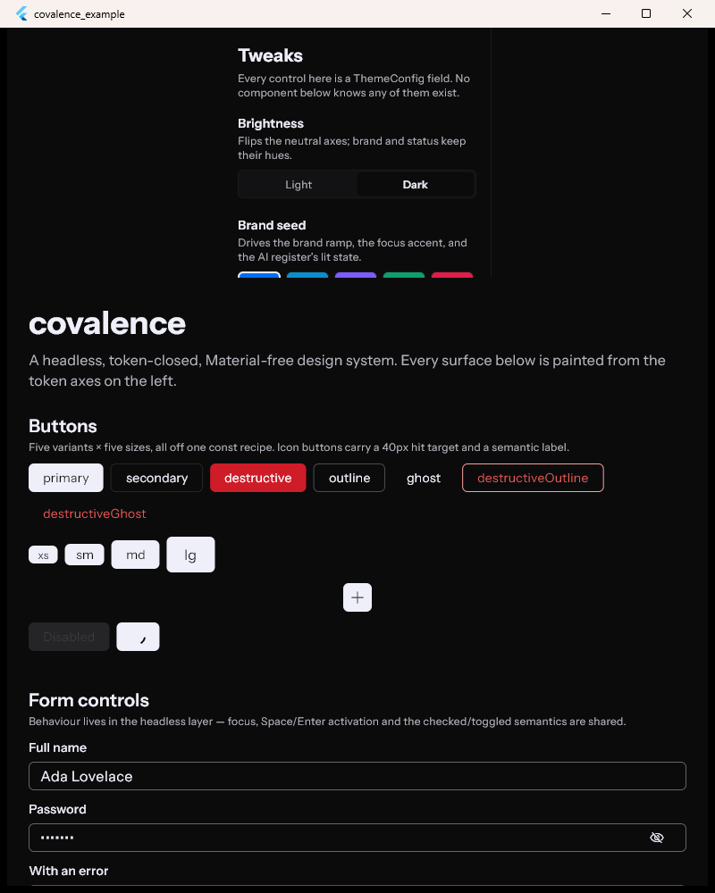
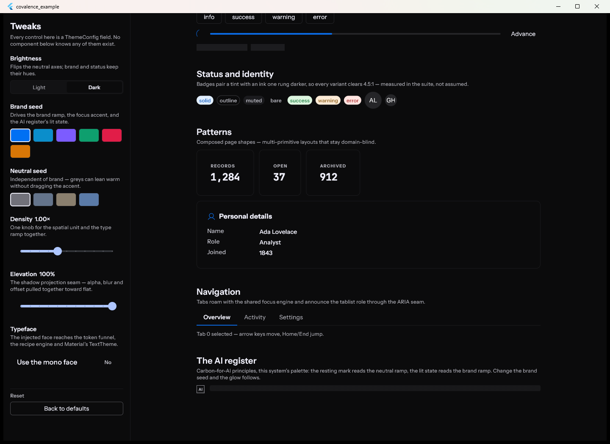
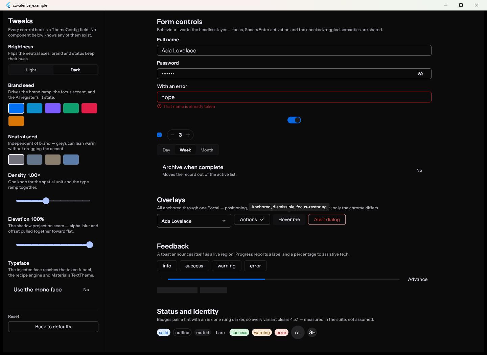
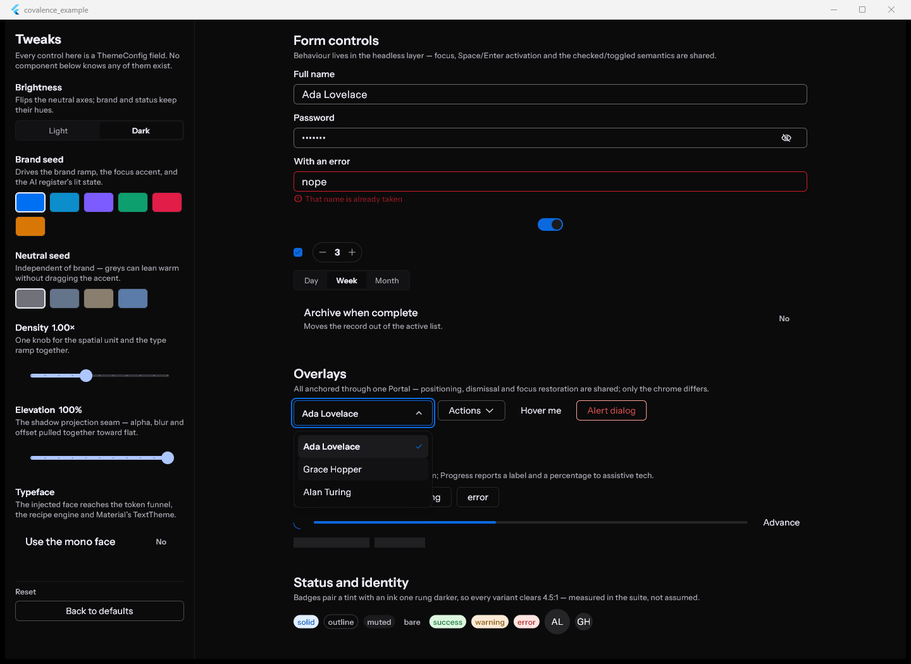
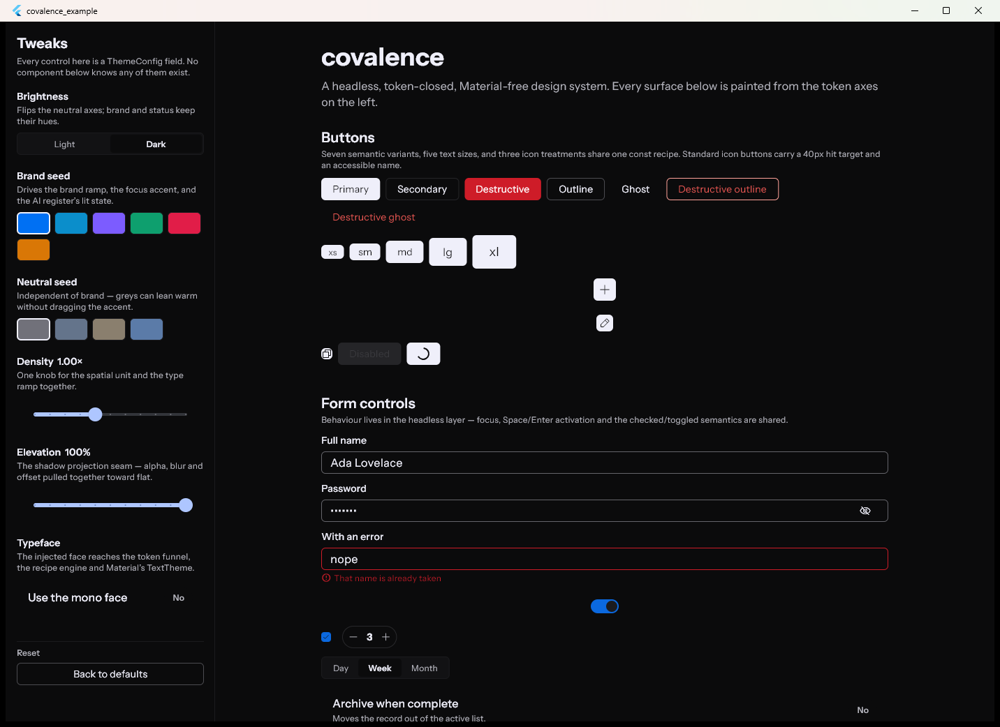
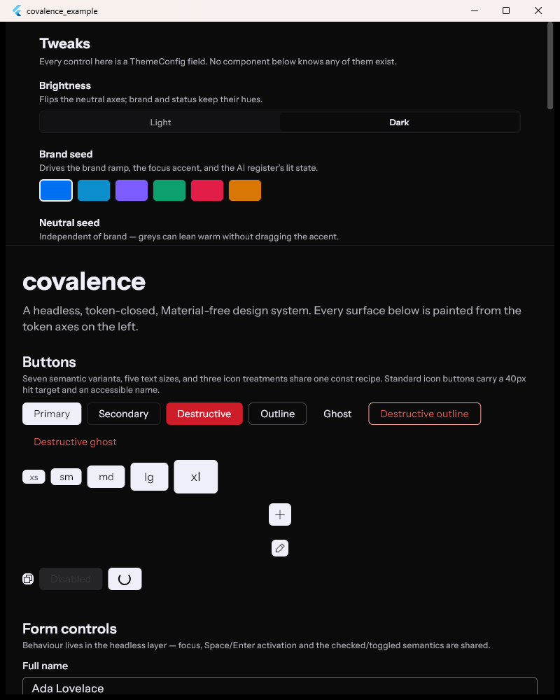
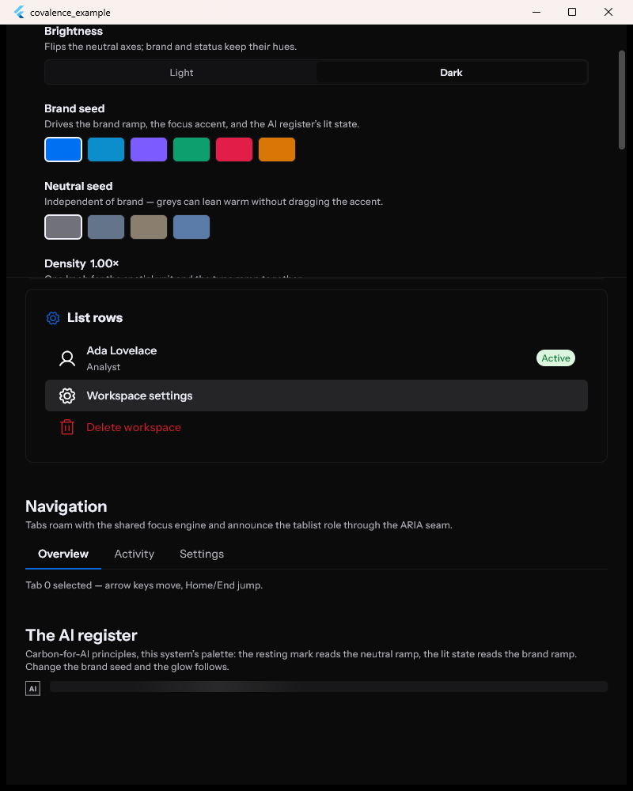

# Covalence system audit

Date: 2026-08-13

Audit target: `D:\Documents\projects\covalence`

Input reviewed: `../covalence-audit/covalence-limits-audit.md`

## Executive verdict

The Astrolabe memo finds the right architectural boundary, but it sometimes describes an intentionally domain-free system as an incapable one. Covalence is already more than a token library: it contains headless interaction behavior, themed controls, list and page composition, responsive layout helpers, semantics, focus management, portal/overlay behavior, and motion. It deliberately does not own product information architecture, process truth, native window policy, or user preference persistence.

The memo is strongest on the platform and domain boundaries. Its main overstatements are the allegedly missing metadata/status primitives, the suggestion that incomplete recipe features imply incomplete component behavior, and the stale claim that Covalence itself still has 34 closure warnings. The reusable gap that remains credible is narrower: Covalence does not yet define a canonical responsive action/status band or a custom desktop-frame composition.

This pass hardened current behavior and documentation without importing Astrolabe-specific nouns or window policy into the design system. The result is clean under Flutter analysis and Covalence's architectural lints, with 286 package tests and 4 gallery smoke tests passing.

## Claim-by-claim audit

| Memo claim | Verdict | What is right | What needs correction |
| --- | --- | --- | --- |
| 1. Tokens do not choose product composition | Correct | Hero placement, divider choice, Library information architecture, and process state mapping are application policy. ADR-007 makes that boundary explicit. | “Tokens” is too narrow a label for Covalence overall; components and headless behaviors do own reusable presentation and interaction contracts. |
| 2. There is no reusable desktop shell pattern | Mostly correct | Covalence does not own a native/custom caption, application frame, or operational footer composition. | It already provides `PageScaffold`, `ListPageLayout`, `PersistentSidePanel`, and `SidePanel`. The missing piece is a desktop-frame policy, not the absence of page or split-view ingredients. |
| 3. Compound lifecycle and metadata bands are missing | Overstated | No component currently owns the exact responsive alignment and priority rules of Astrolabe's lifecycle/action slab. | `LabelValueRow`, `SidePanelInfoRow`, `ListTile`, `Badge`, `Progress`, `StatCard`, `SectionCard`, `Button`, and `RowInteractionShell` already cover most proposed `StatusReadout` behavior. A new status-readout primitive would substantially duplicate the system. |
| 4. Stateful, responsive, and animated recipes are incomplete | Correct about the recipe engine; overstated about the system | ADR-005 still defers breakpoint-conditional and state-driven recipe attributes, and recipe migration is partial. | Covalence components and headless primitives already implement responsive layout, focus/hover/pressed/selected state, portals, and motion. Recipe incompleteness does not force every consumer to hand-roll those behaviors. |
| 5. OS chrome is a hard platform boundary | Correct | Window creation, non-client hit testing, snap layouts, system menus, minimum geometry, and close policy belong to Flutter plugins and the application. | A future headless caption-button behavior may be reusable, but it cannot recover capabilities that the window plugin does not expose. |
| 6. Theme construction is not preference or multi-window synchronization | Correct | Covalence builds themes; it should not silently become a persistence or process-coordination layer. | If multiple apps later need this integration, it belongs in a companion package rather than the core design system. |
| 7. Closure is strong in theory but incomplete in practice | Mixed | Recipe migration remains partial. Astrolabe still reports exactly seven current custom-lint warnings: five unexplained token escapes and two raw sizing primitives. | Covalence itself reports **zero** custom-lint issues. The README's former “34 warnings” statement was stale and has been removed. The analyzer and lint APIs were also migrated in this pass. |
| 8. Accessibility stops where custom composition bypasses primitives | Correct, with an important caveat | App-owned gesture surfaces and captions can bypass Covalence's keyboard, focus-visible, and semantics contracts and need their own tests. | The memo understates Covalence's existing structural coverage: its suite exercises accessible names, roles, expanded/selected/checked state, keyboard activation, roving focus, dismissal, and focus rings. This is evidence, not a screen-reader or WCAG certification. |
| 9. Runtime truth is outside the design system | Correct | Daemon attachment, sync gates, stale dates, and process reconciliation are application/runtime contracts. | None. Covalence should present those states, not determine them. |

## Design forks

### Fork 1 — desktop composition scope

**Recommended: keep native chrome and the full application frame in Astrolabe.** Compose it from the existing Covalence page, panel, button, focus, and token surfaces. Extract a domain-free `DesktopSplitView` only after a second consumer demonstrates the same width, collapse, and divider contract.

Alternative: add a `DesktopScaffold` now. This accelerates Astrolabe but is likely to freeze one product's caption, navigation, footer, and breakpoint decisions into the design system before the abstraction is proven.

Decision trigger: a second Covalence consumer needs the same persistent rail/body geometry without sharing Astrolabe's domain or native-window policy.

### Fork 2 — action/status composition

**Recommended: do not add `StatusReadout`; consider a narrowly scoped `ActionStatusBand` only after reuse appears.** Existing label/value rows, list tiles, badges, progress, buttons, and cards already cover readout content. The genuinely absent contract is how a leading status, metadata, and action cluster prioritize, wrap, and align at constrained widths.

Alternative: add `ActionStatusBand` now with explicit wide/narrow alignment and wrapping rules. This would remove Astrolabe's current layout ambiguity, but a one-consumer API could overfit lifecycle semantics.

Decision trigger: the same leading-status + metadata + trailing-actions shape appears in a second Astrolabe feature or another app.

### Fork 3 — recipe evolution

**Recommended: finish the existing recipe/composer migration before expanding the recipe language.** Keep interaction state in headless/component behavior and responsiveness in layout components until repeated authoring pressure demonstrates that `Recipe.byState`, breakpoint attributes, or an `AnimatedBox` materially reduce duplication.

Alternative: add state, breakpoint, and animated materialization to `Recipe` now. This increases declarative power but also creates a large resolution-order, accessibility, test, and migration surface while two styling paths still coexist.

Decision trigger: repeated component implementations contain the same state/breakpoint style tables rather than merely app-specific layout decisions.

### Fork 4 — caption behavior

**Recommended: keep window and OS behavior app-owned; extract only a headless caption-control interaction primitive after another consumer.** Such a primitive could standardize semantics, keyboard activation, focus-visible state, hover/press state, and minimum target sizing. It must remain independent of `window_manager` and native hit testing.

Alternative: ship a visual caption bar in Covalence. This would look reusable while still being unable to guarantee snap flyouts, system menus, dragging, maximize state, or process close policy.

Decision trigger: another custom-chrome app repeats the same Flutter-side caption interaction code.

### Fork 5 — theme preference integration

**Recommended: keep persistence and cross-process synchronization out of core Covalence.** Create a companion integration package only if multiple applications need the same preference storage and multi-window transport.

Alternative: place preference and window synchronization in the design-system package, coupling a platform-neutral theme constructor to storage and process topology.

Decision trigger: two consumers share an actual transport and persistence contract, not just a light/dark switch.

## Hardening completed

- Made the existing Covalence `ListTile` implementation a supported public entrypoint without colliding with Material's barrel export.
- Made actionable cards respond to pointer hover by default while leaving inert cards visually inert; added regression coverage.
- Replaced the deprecated, view-agnostic semantics announcement path with a supported multi-view-aware announcement guarded by `MediaQuery.supportsAnnounceOf`.
- Migrated analyzer/custom-lint and Flutter semantics test APIs so `flutter analyze` and `dart run custom_lint` are clean.
- Corrected stale README and ADR counts and distinguished exhaustive package tests from the representative gallery.
- Expanded the gallery to show every button variant and size with human-readable labels, plus the public list-row composition.
- Reworked the narrow gallery so theme controls become a full-width, explicitly scrollable inspector instead of a clipped fixed rail.

## Visual evidence

### Step 1 — light gallery

General health: **Good.** The light token vocabulary, compact control sizing, surface hierarchy, and form density are coherent.

### Step 2 — dark gallery

General health: **Good.** Dark surfaces preserve hierarchy and semantic status color without introducing product-specific styling.

### Step 3 — narrow gallery before hardening

General health: **Needs attention.** At 800 px the fixed tweak rail consumed horizontal space and exposed only the beginning of a long control set without a clear narrow-layout contract.

### Step 4 — pattern composition

General health: **Good.** Existing cards, metadata rows, image picker, progress, alerts, navigation, and register patterns demonstrate that Covalence already supports compound composition beyond tokens.

### Step 5 — overlay behavior

General health: **Good in captured pointer states.** Tooltip and anchored overlays share a coherent visual vocabulary; dismissal, restoration, and keyboard behavior are supported by tests rather than proven by the screenshot.

### Step 6 — select open and focused

General health: **Good.** The open select demonstrates portal anchoring, selected state, and focus-visible treatment.

### Step 7 — hardened wide gallery

General health: **Good.** The gallery now accurately documents seven semantic button variants, five text sizes, and three icon treatments.

### Step 8 — hardened narrow gallery

General health: **Good.** At the same 800 px viewport used in Step 3, theme controls stack into a full-width, bounded, scrollable inspector and the gallery retains the full content width below it.

### Step 9 — public list-row composition

General health: **Good.** Standard, selected, destructive, leading-icon, subtitle, and trailing-badge states are composed from the now-public Covalence `ListTile` surface.

## Accessibility and evidence limits

The screenshots establish visual hierarchy, compact-layout behavior, visible focus treatment, and selected/open states. They cannot establish screen-reader speech, keyboard reachability, focus order, 200% text scaling, Windows high-contrast behavior, reduced-motion handling, or contrast compliance. Covalence's automated suite supplies structural evidence for semantics and keyboard contracts, but this audit is not an assistive-technology or WCAG certification.

The Astrolabe memo's two screenshots were useful evidence for application boundaries, but they did not cover narrow, light, keyboard-only, text-scaled, high-contrast, loading, empty, or error states. Those remain Astrolabe audit work rather than proof of a Covalence limitation.

## Verification

- `flutter analyze --no-pub` — no issues
- `dart run custom_lint` — no issues in Covalence
- `flutter test` — 286 passed
- `dart test` in `packages/covalence_lints` — 51 passed
- `flutter test test/smoke_test.dart` in `example` — 4 passed
- `dart run tool/check_domain_free.dart` — passed
- `dart run tool/check_doc_refs.dart` — passed
- Windows debug gallery build — passed and recaptured in Steps 7–9

